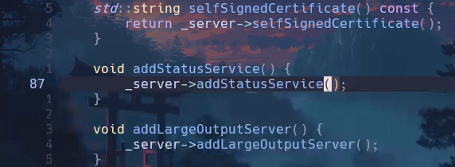

# PerfNvim
This is fork of PerfNvim: a Neovim plugin designed to integrate Perforce version control operations seamlessly into your workflow. It provides easy-to-use key mappings for common Perforce commands, enhancing your productivity.

## Features

- Add current buffer to Perforce (`p4 add`) <br>   
- Edit current buffer in Perforce (`p4 edit`)
- Revert unchanged files
- Signs in changed lines: <br>   
- Navigate between changed lines
- View checked out files using Telescope <br> 
- \[Fork\] Added worker thread that is getting Perforce status in background to avoid blocking the UI (opts.autostart)
- \[Fork\] Added lualine integration to show perforce chengelist of current file (worker needs to be enabled): <br>  
- \[Fork\] Fixed next diff/ precious diff behviour
- \[Fork\] Marking added lines for the files that were opened with `p4 add`


## Installation

### Using [lazy.nvim](https://github.com/folke/lazy.nvim)

Add the following to your `init.lua` or equivalent configuration file:

```lua
{
        "zbiko/perfnvim",
        branch = 'main',
        opts = {
            autostart = true
        },
        config = function(_,opts)
            require("perfnvim").setup(opts)
            vim.keymap.set("n", "<leader>pa", function() require("perfnvim").P4add() end, { noremap = true, silent = true, desc = "'p4 add' current buffer" })
            vim.keymap.set("n", "<leader>pe", function() require("perfnvim").P4edit() end, { noremap = true, silent = true, desc = "'p4 edit' current buffer" })
            vim.keymap.set("n", "<leader>pR", ":!p4 revert -a %<CR>", { noremap = true, silent = true, desc = "Revert if unchanged" })
            vim.keymap.set("n", "]p", function() require("perfnvim").P4next() end, { noremap = true, silent = true, desc = "Jump to next changed line" })
            vim.keymap.set("n", "[p", function() require("perfnvim").P4prev() end, { noremap = true, silent = true, desc = "Jump to previous changed line" })
            vim.keymap.set("n", "<leader>po", function() require("perfnvim").P4opened() end, { noremap = true, silent = true, desc = "List opened files" })
            vim.keymap.set("n", "<leader>pE", function() require("perfnvim").P4enable() end, { noremap = true, silent = true, desc = "Enable perfnvim worker" })
            vim.keymap.set("n", "<leader>pD", function() require("perfnvim").P4disable() end, { noremap = true, silent = true, desc = "Disable perfnvim worker" })
        end,
    },
    {
        "nvim-lualine/lualine.nvim",
        optional = true,
        event = "VeryLazy",
        dependencies = { "zbiko/perfnvim" },
        opts = {
            sections = {
                lualine_b = {
                    {
                        function()
                            local file_path = vim.fn.expand("%:p")
                            if #vim.g.perfnvim_p4_opened_files > 0 then
                                for _, entry in ipairs(vim.g.perfnvim_p4_opened_files) do
                                    if entry.full_path == file_path then
                                        if entry.changelist == "default" then
                                            return " # DEFAULT "
                                        end
                                        local changelist_desc = vim.g.perfnvim_p4_changelists[entry.changelist]
                                        return " #" .. entry.changelist  .. " -> " .. changelist_desc .. " [".. entry.type .."] "
                                    end
                                    vim.g.perfnvim_some_elements_exist = true
                                end
                                if vim.g.perfnvim_some_elements_exist then
                                    vim.g.perfnvim_tmp = true
                                end
                                return " # "
                            end
                            return " "
                        end,
                    },
                },
            },
        }
    }
}
```

### Using [vim-plug](https://github.com/junegunn/vim-plug)

Add the following to your `init.vim` or `init.lua`:

```vim
" If using init.vim
call plug#begin('~/.config/nvim/plugged')

Plug 'zbiko/perfnvim'

call plug#end()

lua << EOF
require("perfnvim").setup()

vim.keymap.set("n", "<leader>pa", function() require("perfnvim").P4add() end, { noremap = true, silent = true, desc = "'p4 add' current buffer" })
vim.keymap.set("n", "<leader>pe", function() require("perfnvim").P4edit() end, { noremap = true, silent = true, desc = "'p4 edit' current buffer" })
vim.keymap.set("n", "<leader>pR", ":!p4 revert -a %<CR>", { noremap = true, silent = true, desc = "Revert if unchanged" })
vim.keymap.set("n", "<leader>pn", function() require("perfnvim").P4next() end, { noremap = true, silent = true, desc = "Jump to next changed line" })
vim.keymap.set("n", "<leader>pp", function() require("perfnvim").P4prev() end, { noremap = true, silent = true, desc = "Jump to previous changed line" })
vim.keymap.set("n", "<leader>po", function() require("perfnvim").P4opened() end, { noremap = true, silent = true, desc = "'p4 opened' (telescope)" })
EOF
```

## Recommended Key Mappings

- `<leader>pa`: `'p4 add'` current buffer
- `<leader>pe`: `'p4 edit'` current buffer
- `<leader>pR`: Revert if unchanged
- `]p`: Jump to next changed line
- `[p`: Jump to previous changed line
- `<leader>po`: `'p4 opened'` (telescope)

These key mappings are designed to enhance your workflow by providing quick access to common Perforce commands. Feel free to customize them to your liking.

## License

This project is licensed under the MIT License. See the [LICENSE](LICENSE) file for details.

## Contributing

Contributions are welcome! Please feel free to open issues or submit pull requests.

